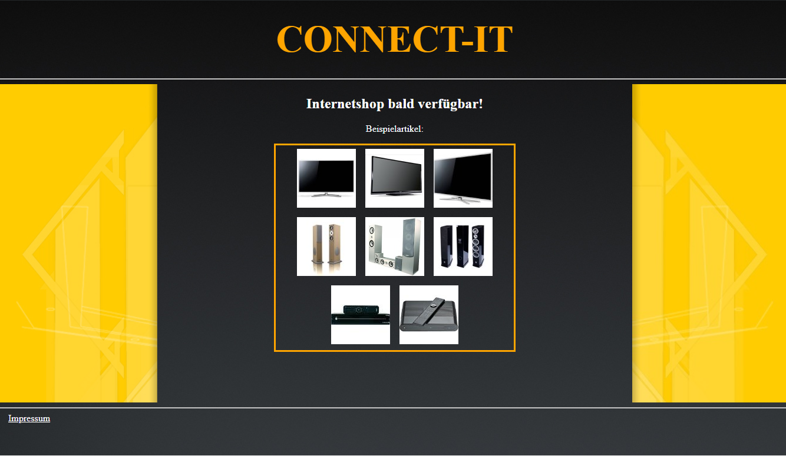

# Basic HTML structures
## Markup & Render



#### [ 0 ] - <span style="color:red">Red</span> box:

```html
<!--
   -    Gives <div> an id "header"
   -    -> id used as #id, class used as .id in css
  -->
<div id="header">

  <!--
     -    Format text "CONNECT-IT" as <h1>
     -    define <a> link with index.html as destination
    -->
  <h1><a href="index.html">CONNECT-IT</a></h1>

  <!-- Closing the <div id="header"> tag -->
</div>
```

```css
/* Properties child-tag <a> from <h1> */
h1 a {
  color: orange;
  font-size: 2em;
}

/* Properties of all <h2>, <p>, <a> */
h2, p, a { color: white; }

#header {
  /* Working with percentage, responsive for beginners */
  height: 15%;
  width: 100%;
  display: flex;
  align-items: center;
  justify-content: center;
}

#header a {
  /* Removes link decoration, e.g. underlined text */
  text-decoration: none;
}
```

<hr>

#### [ 1 ] - <span style="color:blue">Blue</span> box:
```HTML
<!-- Gives <div> an id "content" -->
<div id="content">
  <!--
     -    Gives <div> an id "border-left"
     -    Properties like background set in css
   -->
  <div id="border-left">
  </div>

  <!-- Gives <div> an id "main" -->
  <div id="main">
    <!-- Some text, better than lorem ipsum -->
    <h2>Internetshop bald verfügbar!</h2>
    <p>Beispielartikel:</p>

    <!--  CSS Propertie text-align: center;
       -  doesn't work with images
     -->
    <center>
    <div id="article">
      <!-- Embedd image, alt text appears when image's missing -->
      
      
      
      
      
      
      
      
    </div>
    </center>

  </div>

  <!-- Same as border-left -->
  <div id="border-right">
  </div>
</div>
```

```CSS
#content {
  /* Keep the 15% of header in mind, makes 15% left */
  height: 70%;
  width: 100%;
}

#border-left {
  /* Now full height, corresponding to those 70% */
  height: 100%;
  /* Split it in 3 rows, border-right 20%, 60% for main and last 20% for border-right */
  width: 20%;
  /* Makes position dynamic*/
  position: relative;
  /* Background properties */
  background-image: url("../img/border-left.jpg");
  background-repeat: no-repeat;
  background-size: cover;
  /* Let it float left */
  float: left;
}

#main {
  height: 100%;
  width: 60%;
  position: relative;
  float: left;
  /* doesn't work with images */
  text-align: center;
}

#article {
  width: 50%;
  /* Using grid instead of tables in html*/
  position: grid;
  border-style: solid;
  border-width: medium;
  border-color: orange;
}

#article img {
  /* Padding between  <->  and margin  <-> <div> */
  margin: 3 3 3 3;
  padding: 3 3 3 3;
}

#border-right {
  height: 100%;
  width: 20%;
  position: relative;
  background-image: url("../img/border-right.jpg");
  background-repeat: no-repeat;
  background-size: cover;
  float: left;
}
```

<hr>

#### [ 2 ] - Child <span style="color:green">border-right</span> inside [ 1 ] <span style="color:blue">blue</span> box:
